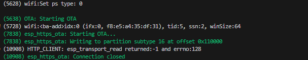

#CASO DE ESTUDIO

Para este caso de estudio se implemento:

    *Visual Studio Code (Herramienta de desarrollo)
    *idf espressif (ide componentes y drives de la esp32) 4.3.1
    *Libreria
        -OTA `esp_https_ota`

# LIBRERIA OTA

El codigo base para configuración OTA se basa en las APIs del componente  `esp_https_ota`

Para el desarrollo de la aplicación OTA se implemento de la siguiente manera

Como codigo de ejemplo de utilizo el repositorio 'hello_world' de espressif en donde para lanzar el servidor se debieron realizar los siguientes pasos en una terminal

    build
    cd build
    openssl req -x509 -newkey rsa:2048 -keyout ca_key.pem -out ca_cert.pem -days 365 -nodes
        'Se ingresan los parametros solicitados'
    openssl s_server -WWW -key ca_key.pem -cert ca_cert.pem -port 8070
        'Lanzamos el servidor'
    
    Con lo anterior verificamos la creación del certificado 'ca_key.perm'
    'ca_key.perm' este certificado se debera actualizar en el directorio .\server_certs del directorio principal de la esp

Para compilar y ejecutar el codigo en la esp32:
    cd ./OTA.C
    idf.py menuconfig
        Example Configuration
            https://IPLOCALSERVER:8070/hello_world.bin
            EJEMPLO 
            https://192.168.10.13:8070/hello_world.bin
            IP LOCAL SERVER SERA LA IP DEL PC QUE LANZARA EL SERVIDOR LOCAL
             
        Example Connection Configuratio
            configurar WI-FI 
                ssdi
                password
        
    build / flash esp32 ethernet

# LIBRERIA I2C

Para el desarrollo del modulo de comunicacion i2c se implemento el driver del componente idf i2c en el cual se realiza la comunicacion 
    master -> esp32
    slave  -> extensor 24v

# LIBRERIA TWAI (Modulo de comunicacion CAN) VEHICULO

Modelo de conexion para TWAI para conexiones CAN 
    ----------   ----------   --------------  
   |  Master  | |  Slave   | | Listen Only  | 
   |          | |          | |              | 
   | TX    RX | | TX    RX | | TX    RX     | 
    ----------   ----------   --------------  
     |      |     |      |     |      |   
     |      |     |      |     |      |   
    ----------   ----------   ----------  
   | D      R | | D      R | | D      R | 
   |          | |          | |          | 
   |  VP230   | |  VP230   | |  VP230   | 
   |          | |          | |          | 
   | H      L | | H      L | | H      L | 
    ----------   ----------   ----------  
     |      |     |      |     |      |   
     |      |     |      |     |      |   
  |--x------|-----x------|-----x------|--| H
            |            |            |
  |---------x------------x------------x--| L

Para el modulo CAN se implemento el componente twai de espressif en el cual se usa de la siguiente manera

Configuraciones de pines de comunicacion 
    #define TX_GPIO_NUM             GPIO_NUM_17
    #define RX_GPIO_NUM             GPIO_NUM_16

Se configura el twai_filter_config_t ya que en este caso tenemos multiplies ID

Creacion de tres tareas
    transmision 'twai_transmit_task' = envio de datos al esclavo    
    recepcion  'twai_receive_task' = escucha de datos desde esclavo 
    control  'twai_control_task' = control de inicializacion de driver para enviar comnados al esclavo

Creacion de colas para envio de los datos y que no exista overflow ya que el modulo Can posee la trama de la siguiente manera:

 * BITS ID 29 u 11  trama extendida / trama estándar : determina la prioridad del mensaje
 * Codigo para Datos: entre 0 y 8 para indicar solicitud o envio de datos
 * 8 bytes de datos para un marco de datos (Deebe ser igual al codigo de datos).

Dichas tareas seran controladas a su vez por un semaforo en el cual no permitira la ejecucion de TX y RX simultaneamente

# LIBRERIA TWAI (Modulo de comunicacion CAN) RECTIFICADORES Solo lectura

Como en el componente anterior de espressif se uso nuevamente el modulo TWAI para comunicacion CAN 
de solo lectura

#define RX_TASK_PRIO                    9
#define TX_GPIO_NUM                     GPIO_NUM_01
#define RX_GPIO_NUM                     GPIO_NUM_03

Con esta macro garantizamos que el master sera configurado en modo solo escucha
    static const twai_general_config_t g_config = {.mode = TWAI_MODE_LISTEN_ONLY,
                                                .tx_io = TX_GPIO_NUM, .rx_io = RX_GPIO_NUM,
                                                .clkout_io = TWAI_IO_UNUSED, .bus_off_io = TWAI_IO_UNUSED,
                                                .tx_queue_len = 0, .rx_queue_len = 5,
                                                .alerts_enabled = TWAI_ALERT_NONE,
                                                .clkout_divider = 0
                                                };

Configuramos nuevamente los GPIO de la esp32 ETHERNET
Se instala driver
    twai_driver_install(&g_config, &t_config, &f_config);
Se inicializa driver
    twai_start();
Se detiene driver
    twai_stop();
Se desinstala driver
    twai_driver_uninstall();  // El driver es desinstalado para que la memoria no le asigne espacio al mismo

Con lo anterior es suficiente para preparar un dato enviarlo y recibirlo de maestro a esclavo

## Configuration

Refer README.md in the parent directory for setup details

https://github.com/espressif/esp-idf/blob/8fc8f3f47997aadba21facabc66004c1d22de181/examples/system/ota/README.md
